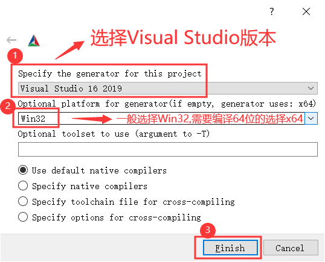
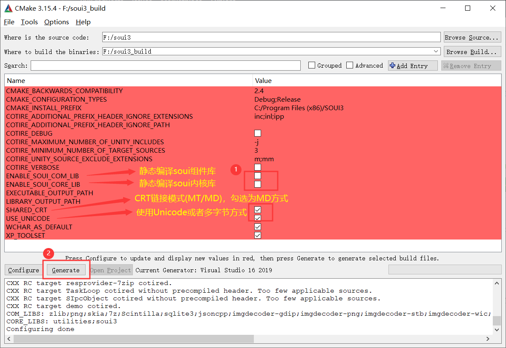
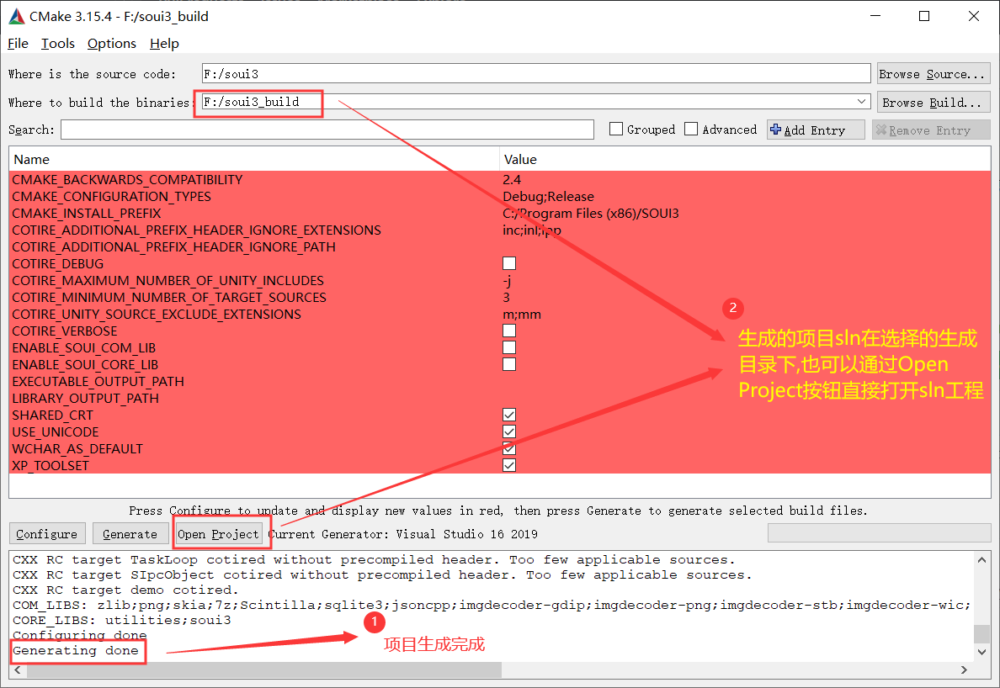
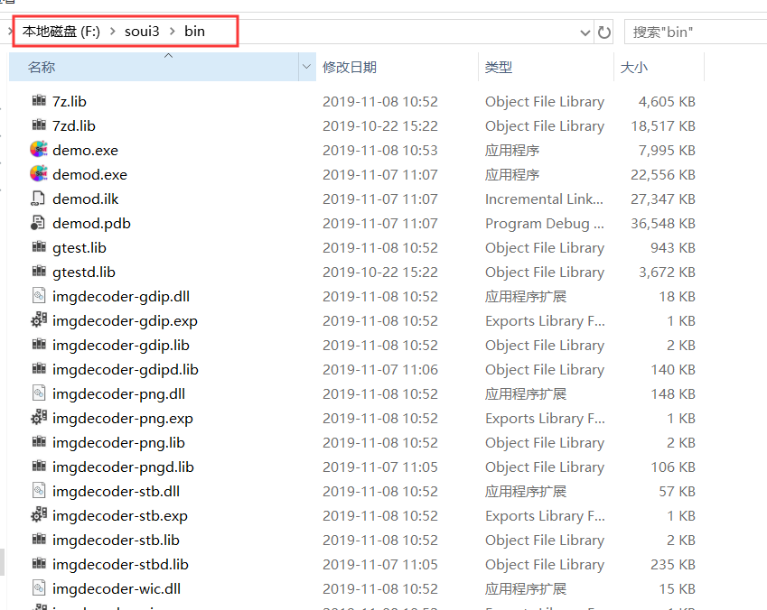

# `SOUI`

### 简介:
SOUI是目前为数不多的轻量级可快速开发window桌面程序开源DirectUI库.其前身为Duiengine,更早期则是源自于金山卫士开源版本UI库Bkwin.经过作者多次开发维护升级后得此库.SOUI其寓意为"瘦UI" "UI,just so so!",目的就是能够快速开发,并且在产品发布局时不需要携带其它额外的第三方依赖库,高度精简及集中;模块化使得渲染模块,图片解码模块,资源打包压缩模块得以清晰分离,更能够高度的自定义.UI解析目前可采用的是XML布局,便于理解各控件之间的层级关系及其自身的属性设置.目前已有很多成功的商业产品,深受广大开发者及企业的青睐

### Git下载地址

- [国内Git下载站点](https://gitee.com/setoutsoft/soui3)

- [国外Git下载站点](https://github.com/soui3/soui)

### DEMO仓库：
- https://github.com/soui3-demo
* 每一个Demo一个单独的仓库，自己分别clone就好了。如果想一次拉取所有demo,可以直接运行SOUI仓库代码下的clone_demos.bat来clone，当然前提是已经安装了git命令行工具。

### 编译
- SOUI提供了多种编译方式包括qmake,cmake,nmake等等.我们推荐使用qmake方式生成符合自己的Visual Studio 版本项目工程文件,当然,如果你有兴趣也可以尝试cmake与nmake两种方式
* #### `qmake`(推荐)
    使用 git 摘取代码后,进入代码根目录,双击运行"build.bat"
    * `1.选择编译版本[1=x86;2=x64;3=x86+x64]:`选择需要编译的cpu架构(eg:1则表示生成win32的可执行文件)
    * `2.选择开发环境[1=2008;2=2010;3=2012;4=2013;5=2015;6=2017;7=2005]:`选择对应的 Visual Studio 版本(eg:1表示选择使用 Visual Studio 2008)注意SOUI至少需要Visual Studio 2008 SP1及以上的 Visual Studio 版本
    * `3.选择SOUI编译模式[1=全模块DLL;2=全模块LIB;3=内核LIB,组件DLL(不能使用LUA脚本模块)]:`选择生成内核的文件方式(eg:1表示所生成的内核文件及组件均为dll)
    * `4.选择字符集[1=UNICODE;2=MBCS]:`(推荐选1)
    * `5.将WCHAR作为内建类型[1=是;2=否]:`(推荐选1)
    * `6.选择CRT链接模式[1=静态链接(MT);2=动态链接(MD)]:`(根据自大项目需求选择)
    * `7.是否为release版本生成调试信息[1=生成;2=不生成]:`(根据自大项目需求选择)
    * `open[o], compile[c] "soui.sln" or quit(q) [o,c or q]?`输入英文字母o表示打开工程项目,c表示直接编译debug与release,q表示直接退出当前窗口
* #### `nmake`(目前仅支持编译成dll形式)
    * 打开编译工具命令控制台窗口,输入"nmake",默认生成 x86 release 的 soui 内核依赖与两个渲染组件(gdi各skia) 图片解码组件为 png 还有 demo 运行程序,CRT为动态链接
    * 其它额外编译参数如下:
        * `nmake TYPE=Debug` 表示生成 x86 debug 模式
        * `nmake ABI=x64` 表示生成 x64 的 release 模式,如果需要 debug 模式在后面增加 `TYPE=Debug` 即可
        * `nmake CRT=-MT` 表示静态链接CRT  
* #### `cmake`
    * 从cmake官网下载cmake的最新Release版本,这里以cmake-3.15.4-win64-x64.zip举例。
    * 将cmake-3.15.4-win64-x64.zip解压后运行bin目录下的cmake-gui.exe。
    * 选择soui源码目录和cmake临时文件生成目录，点击Configure。
    
    * 弹出临时文件目录不存在，是否创建？选择Yes。   
    
    * 选择需要生成的VS版本(如果未安装会生成失败,根据实际情况选择)和需要生成的编译版本(Win32\x64)，点击Finish。   
    
    * 根据需要选择生成方式：内核和组件模块的(静态链接或动态链接)；是否使用CRT；Unicode或多字节；点击Generate开始生成。   
    
    * 生成完毕,显示"Generating done"，此时点击Open Project打开项目(也可以双击cmake临时文件生成目录中找到sln文件打开)
    
    * 在VS中编译，编译完成后,在soui源码的bin目录下可以找到生成出来的dll(或lib)和exe。
    

### 论坛
- http://www.soui.vip
### QQ群

- SOUI讨论#1: [点击加入](http://shang.qq.com/wpa/qunwpa?idkey=9653a811a72365d798a5247d6ba6885a568bdcf51c624f906c8ce7b8fd9e4eda)
- SOUI讨论#2: [点击加入](http://shang.qq.com/wpa/qunwpa?idkey=03d3294a2551beb1b54b4012086cec14b3f66d5c253debaeed241d9c623966e0)

### 极力推荐
- 阅读作者[博客](http://www.cnblogs.com/setoutsoft/)，能让你更快掌握如何使用SOUI快速开发Window桌面应用
- 教学[视频](http://my.tv.sohu.com/pl/9259542/89333168.shtml)
